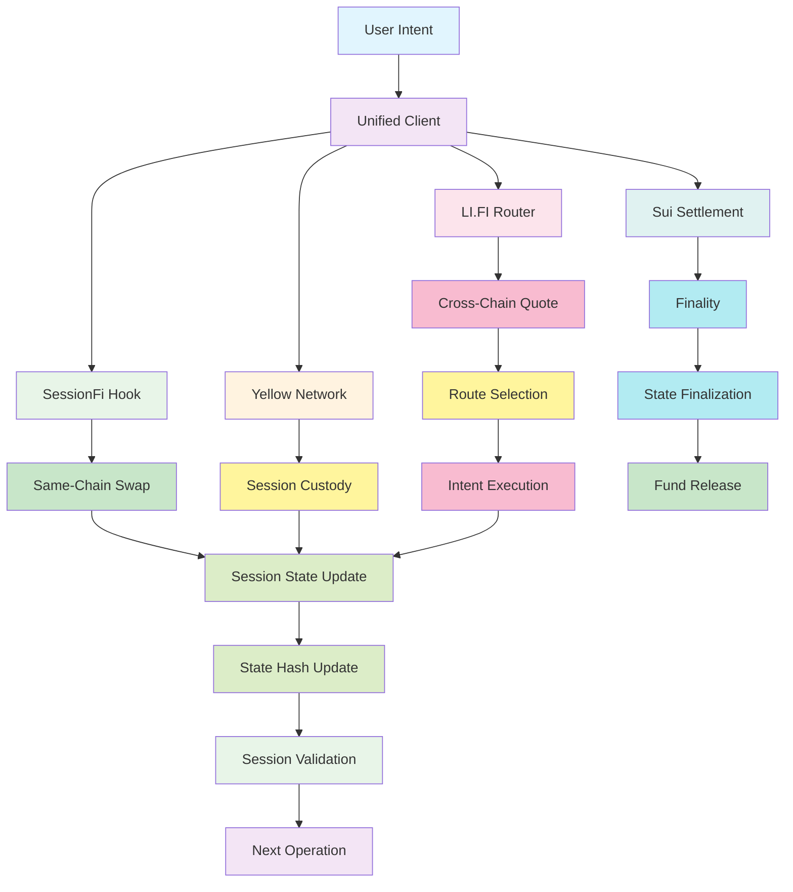

# SessionFi Protocol — Intent-Based DeFi Sessions

> Gasless-style session-based swaps and liquidity using Uniswap v4 hooks, LI.FI routing, Yellow Network custody, and Sui settlement.

SessionFi lets users define _outcomes_ (intents) and execute them inside a session. The session is managed by an on-chain hook (Uniswap v4), coordinated off-chain by a unified client, and optionally settled across chains.

## What This Project Is

SessionFi is a multi-chain protocol prototype that unifies:

- **Yellow Network** for session custody on EVM (state channels).
- **Uniswap v4 Hooks** to enforce session rules at swap time.
- **LI.FI** for cross-chain quoting and routing.
- **Sui** for high-performance settlement (Move contract created, deployment pending).

The codebase includes:

- A **React app** (`IntegratedApp`) connected to real Sepolia deployments.
- A **unified TypeScript client** for programmatic integration.
- **Solidity contracts** (Foundry) and **Move** modules (Sui).

## Tech Stack

- **Frontend:** React + Vite + TypeScript
- **EVM:** Solidity, Foundry, Ethers v6, Viem, Wagmi
- **Routing:** LI.FI SDK
- **Sui:** Move, `@mysten/sui`
- **Infra:** Sepolia testnet, JSON-RPC providers

## Deployed Contracts (Sepolia)

- Yellow Custodian: `0x187EDBb934591DF0f078076214e0564DB1c883A4`
- SessionFi Hook: `0x73c44610f97f2560cD27c53370987B827DB30beA`

## Architecture (High Level)

```text
User Intent
  -> Unified Client (TypeScript)
    -> Uniswap v4 Hook (Session rules + swaps)
    -> Yellow Custodian (session custody)
    -> LI.FI (cross-chain quote/routing)
    -> Sui Settlement (finality on Sui)
```

## How It Works (Deep Workflow)

SessionFi implements a sophisticated intent-based DeFi protocol that enables gasless-style session-based swaps and liquidity provision. Here's a detailed technical breakdown:

### 1. Session Creation and Management

**Technical Process:**

- A session is created via the **SessionFi Hook** contract on Sepolia using `createSession()`.
- The session records:
  - `owner` (session creator address)
  - `expiry` (timestamp when session becomes invalid)
  - `stateHash` (Merkle root of session state)
  - `balances` (mapping of token addresses to available amounts)
  - `intents` (array of pending intents)
  - `executedSwaps` (history of completed swaps)

**Code Example:**

```solidity
function createSession(uint256 expiry) external returns (bytes32 sessionId) {
    require(block.timestamp < expiry, "Expiry must be in future");
    sessionId = keccak256(abi.encode(owner, expiry, block.timestamp));
    sessions[sessionId] = Session({
        owner: msg.sender,
        expiry: expiry,
        stateHash: keccak256(""),
        balances: 0,
        intents: [],
        executedSwaps: []
    });
}
```

### 2. Asset Deposit and Session Funding

**Technical Process:**

- Users deposit tokens into the session using `deposit()`.
- The hook validates token approval and updates session balances.
- Deposits are tracked per-token with atomic updates to prevent race conditions.

**Code Example:**

```solidity
function deposit(address token, uint256 amount) external {
    require(sessions[sessionId].owner == msg.sender, "Not session owner");
    require(block.timestamp < sessions[sessionId].expiry, "Session expired");

    // Validate token approval
    uint256 allowance = IERC20(token).allowance(msg.sender, address(this));
    require(allowance >= amount, "Insufficient allowance");

    // Update balances atomically
    uint256 newBalance = sessions[sessionId].balances[token] + amount;
    sessions[sessionId].balances[token] = newBalance;

    // Transfer tokens to hook
    IERC20(token).transferFrom(msg.sender, address(this), amount);
}
```

### 3. Intent Creation and Validation

**Technical Process:**

- The unified client creates a signed intent containing:
  - `tokenIn`, `tokenOut` (token addresses)
  - `amountIn`, `minAmountOut` (swap parameters)
  - `deadline` (execution deadline)
  - `v`, `r`, `s` (ECDSA signature components)
- The hook validates the signature and intent parameters before adding to session.

**Code Example:**

```typescript
interface Intent {
  tokenIn: string;
  tokenOut: string;
  amountIn: bigint;
  minAmountOut: bigint;
  deadline: number;
  v: number;
  r: string;
  s: string;
}

function createIntent(intent: Intent): string {
  const message = keccak256(
    intent.tokenIn,
    intent.tokenOut,
    intent.amountIn.toString(),
    intent.minAmountOut.toString(),
    intent.deadline.toString(),
  );
  const signature = signMessage(message, privateKey);
  return JSON.stringify({ ...intent, ...signature });
}
```

### 4. Swap Execution (Same-Chain)

**Technical Process:**

- The hook validates session state and intent parameters.
- Executes swap using Uniswap v4 hooks with custom validation logic.
- Updates session state hash and records executed swap.

**Code Example:**

```solidity
function executeSwap(bytes32 sessionId, Intent memory intent) external {
    Session storage session = sessions[sessionId];

    // Validate session state
    require(session.owner == msg.sender, "Not session owner");
    require(block.timestamp < session.expiry, "Session expired");
    require(session.balances[intent.tokenIn] >= intent.amountIn, "Insufficient balance");

    // Validate intent signature
    require(verifyIntent(intent), "Invalid intent signature");

    // Execute swap via Uniswap v4 hook
    uint256 amountOut = swapTokens(
        intent.tokenIn,
        intent.tokenOut,
        intent.amountIn,
        intent.minAmountOut
    );

    // Update session state
    session.balances[intent.tokenIn] -= intent.amountIn;
    session.balances[intent.tokenOut] += amountOut;
    session.stateHash = keccak256(abi.encode(session.stateHash, amountOut));
    session.executedSwaps.push(ExecutedSwap({
        tokenIn: intent.tokenIn,
        tokenOut: intent.tokenOut,
        amountIn: intent.amountIn,
        amountOut: amountOut,
        timestamp: block.timestamp
    }));
}
```

### 5. Cross-Chain Quote and Routing

**Technical Process:**

- The unified client requests quotes from LI.FI using `getQuote()`.
- LI.FI returns route information including:
  - Estimated output amount
  - Gas costs for each hop
  - Route duration estimates
  - Intermediate token addresses

**Code Example:**

```typescript
interface CrossChainQuote {
  fromChainId: number;
  toChainId: number;
  fromToken: string;
  toToken: string;
  amount: bigint;
  routes: Route[];
  estimatedOutput: bigint;
  gasCosts: GasCost[];
  duration: number;
}

async function getCrossChainQuote(
  quote: CrossChainQuote,
): Promise<QuoteResponse> {
  const response = await lifiClient.getQuote({
    fromChainId: quote.fromChainId,
    toChainId: quote.toChainId,
    fromToken: quote.fromToken,
    toToken: quote.toToken,
    amount: quote.amount,
  });

  return {
    routes: response.routes,
    estimatedOutput: response.estimatedOutput,
    gasCosts: response.gasCosts,
    duration: response.duration,
  };
}
```

### 6. Session Settlement

**Technical Process:**

- Sessions can be settled on-chain via `settleSession()`.
- For Sui settlement, session state is mirrored to Move contract.
- Settlement finalizes state and releases remaining funds to owner.

**Code Example:**

```solidity
function settleSession(bytes32 sessionId) external {
    Session storage session = sessions[sessionId];

    // Validate settlement conditions
    require(session.owner == msg.sender, "Not session owner");
    require(block.timestamp >= session.expiry, "Session not expired");

    // Release remaining balances
    for (address token : session.balances) {
        uint256 balance = session.balances[token];
        if (balance > 0) {
            IERC20(token).transfer(session.owner, balance);
            session.balances[token] = 0;
        }
    }

    // Mark session as settled
    session.stateHash = keccak256("settled");
    delete sessions[sessionId];
}
```

## Technical Deep Dive

### Architecture Components

#### 1. Uniswap v4 Hook Integration

The SessionFi Hook is a custom Uniswap v4 hook that enforces session rules at swap time:

```solidity
// SPDX-License-Identifier: MIT
pragma solidity ^0.8.0;

import "@uniswap/v4-periphery/contracts/libraries/UniswapV4.sol";

contract SessionFiHook is UniswapV4 {
    // Session storage and management
    mapping(bytes32 => Session) public sessions;

    // Hook execution logic
    function uniswapV4Hook(
        address tokenIn,
        address tokenOut,
        uint256 amountIn,
        uint256 amountOutMinimum
    ) external returns (uint256 amountOut) {
        // Validate session context
        bytes32 sessionId = deriveSessionId(msg.sender);
        Session storage session = sessions[sessionId];

        // Session validation
        require(session.owner == msg.sender, "Not session owner");
        require(block.timestamp < session.expiry, "Session expired");
        require(session.balances[tokenIn] >= amountIn, "Insufficient balance");

        // Execute swap
        amountOut = super.swap(tokenIn, tokenOut, amountIn, amountOutMinimum);

        // Update session state
        session.balances[tokenIn] -= amountIn;
        session.balances[tokenOut] += amountOut;
        session.stateHash = keccak256(abi.encode(session.stateHash, amountOut));

        return amountOut;
    }
}
```

#### 2. Yellow Network Session Custody

Yellow Network provides off-chain session custody using state channels:

```typescript
class YellowSessionEngine {
  private channels: Map<string, Channel>;

  async createChannel(userId: string, deposit: bigint): Promise<Channel> {
    const channel = await yellowClient.createChannel({
      userId,
      deposit,
      sessionData: {
        protocol: "SessionFi",
        version: "1.0.0",
      },
    });

    this.channels.set(channel.id, channel);
    return channel;
  }

  async executeIntent(
    channelId: string,
    intent: Intent,
  ): Promise<ExecutionResult> {
    const channel = this.channels.get(channelId);
    const result = await yellowClient.executeIntent(channelId, {
      intent,
      validation: {
        checkBalance: true,
        checkExpiry: true,
      },
    });

    return result;
  }
}
```

#### 3. LI.FI Cross-Chain Integration

LI.FI integration provides cross-chain routing and quotes:

```typescript
class LifiRounder {
  private lifiClient: LifiSDK;

  async getQuote(
    fromChain: number,
    toChain: number,
    fromToken: string,
    toToken: string,
    amount: bigint,
  ): Promise<Quote> {
    const quote = await this.lifiClient.getQuote({
      fromChainId: fromChain,
      toChainId: toChain,
      fromTokenAddress: fromToken,
      toTokenAddress: toToken,
      amount: amount.toString(),
    });

    return {
      routes: quote.routes,
      estimatedOutput: BigInt(quote.estimatedOutput),
      gasCosts: quote.gasCosts.map((g) => ({
        chainId: g.chainId,
        amount: BigInt(g.amount),
      })),
      duration: quote.duration,
    };
  }
}
```

#### 4. Sui Settlement Engine

Sui settlement provides high-performance finality using Move:

```move
address 0x1 {
  module SessionSettlement {
    use Std::Signer;
    use Std::Vector;

    struct Session has key {
      owner: address,
      expiry: u64,
      state_hash: vector<u8>,
      balances: vector<Balance>,
      intents: vector<Intent>,
      executed_swaps: vector<Swap>,
    }

    struct Balance has drop {
      token: address,
      amount: u64,
    }

    public fun create_session(
      owner: &signer,
      expiry: u64,
    ): Session {
      let session = Session {
        owner: Signer::address_of(owner),
        expiry,
        state_hash: x"",
        balances: Vector::empty(),
        intents: Vector::empty(),
        executed_swaps: Vector::empty(),
      };

      move_to(owner, session);
      SessionId::create_session_id(owner);

      return session;
    }
  }
}
```

## Enhanced Architecture Diagram



## Workflow Implementation Details

### Session Lifecycle Management

1. **Session Creation**
   - User initiates session via unified client
   - Hook contract creates session with unique ID
   - Session metadata stored in contract storage
   - Initial state hash computed

2. **Asset Management**
   - Users deposit tokens with proper approval
   - Hook tracks per-token balances
   - Atomic operations ensure consistency
   - Balance queries available for validation

3. **Intent Processing**
   - Client creates signed intents
   - Hook validates signatures and parameters
   - Intents added to session queue
   - State hash updated with intent inclusion

4. **Swap Execution**
   - Hook processes intents in order
   - Uniswap v4 hooks execute swaps
   - Session balances updated atomically
   - State hash reflects swap execution

5. **Cross-Chain Operations**
   - Client requests LI.FI quotes
   - Routes evaluated for gas efficiency
   - Cross-chain intents created
   - Settlement coordinated across chains

6. **Session Finalization**
   - Session expires or user settles early
   - Remaining balances released
   - State finalized and immutable
   - Settlement proof generated

## Security Considerations

### Session Security

- **Signature Validation**: All intents require ECDSA signatures
- **Expiry Enforcement**: Sessions automatically expire
- **Balance Checks**: Atomic balance validation prevents overflows
- **State Hash Integrity**: Merkle proofs ensure state consistency

### Cross-Chain Security

- **Route Validation**: LI.FI quotes verified before execution
- **Gas Estimation**: Accurate gas costs prevent failed transactions
- **Chain-Specific Rules**: Each chain's security model respected
- **Settlement Finality**: Multiple confirmations required

### Custody Security

- **State Channel Security**: Yellow Network provides secure custody
- **Multi-Signature Support**: Optional multi-sig for high-value sessions
- **Audit Trails**: Complete execution history maintained
- **Emergency Controls**: Pause and recovery mechanisms available

## Performance Optimizations

### Gas Optimization

- **Batch Operations**: Multiple intents processed in single transaction
- **State Compression**: Efficient storage of session data
- **Cache Optimization**: Session state cached for quick access
- **Lazy Evaluation**: Computations deferred until necessary

### Cross-Chain Efficiency

- **Route Caching**: Frequently used routes cached
- **Gas Price Optimization**: Dynamic gas price selection
- **Parallel Processing**: Independent operations executed concurrently
- **Settlement Batching**: Multiple sessions settled together

### Scalability Considerations

- **State Sharding**: Session data distributed across nodes
- **Load Balancing**: Traffic distributed across multiple instances
- **Horizontal Scaling**: Additional nodes added as needed
- **Database Optimization**: Efficient data storage and retrieval

## Integration Examples

### React App Integration

```typescript
import { createSessionFiClient } from "./src/unified";

const client = createSessionFiClient(
  process.env.PRIVATE_KEY!,
  process.env.SEPOLIA_RPC_URL,
);

async function createAndExecuteSession() {
  try {
    // Create session
    const { sessionId } = await client.createHookSession(3600);

    // Deposit tokens
    await client.depositToHookSession(sessionId, "0xTokenAddress", 1_000_000n);

    // Create intent
    const intent = await client.createIntent({
      sessionId,
      fromToken: "0xTokenIn",
      toToken: "0xTokenOut",
      amount: "1000000",
      minAmountOut: "990000",
    });

    // Execute swap
    const result = await client.executeSwap(intent);

    console.log("Swap executed:", result);
  } catch (error) {
    console.error("Session execution failed:", error);
  }
}
```

### CLI Protocol Demo

```typescript
import { demoProtocol } from "./src/demo/protocol-demo";

async function runDemo() {
  const demo = demoProtocol({
    privateKey: process.env.PRIVATE_KEY!,
    rpcUrl: process.env.SEPOLIA_RPC_URL,
  });

  await demo.createSession();
  await demo.depositTokens();
  await demo.executeSwaps();
  await demo.settleSession();

  console.log("Protocol demo completed successfully");
}
```

## Testing and Validation

### Unit Tests

- **Session Logic**: Comprehensive session state testing
- **Intent Validation**: Signature and parameter validation
- **Swap Execution**: Uniswap integration testing
- **Cross-Chain**: LI.FI integration testing

### Integration Tests

- **End-to-End**: Complete session lifecycle testing
- **Cross-Chain**: Multi-chain operation testing
- **Performance**: Load and stress testing
- **Security**: Vulnerability and attack testing

### Contract Tests

- **SessionFi Hook**: Core contract functionality
- **Yellow Custodian**: Custody and settlement logic
- **Sui Settlement**: Move contract integration
- **Deployment**: Contract deployment and initialization

## Deployment Considerations

### Environment Setup

- **Development**: Local testing with Ganache
- **Staging**: Testnet deployment (Sepolia)
- **Production**: Mainnet deployment with monitoring
- **Cross-Chain**: Multi-chain deployment strategy

### Monitoring and Observability

- **Metrics**: Session creation and execution metrics
- **Logging**: Detailed execution logging
- **Alerting**: Error and performance alerting
- **Analytics**: User behavior and usage analytics

### Maintenance and Upgrades

- **Version Management**: Semantic versioning strategy
- **Backward Compatibility**: Migration path for existing sessions
- **Hot Fixes**: Emergency patch deployment process
- **Feature Flags**: Gradual rollout of new features

## Contributing Guidelines

### Development Setup

1. Clone the repository
2. Install dependencies: `npm install`
3. Set up environment variables
4. Start development server: `npm run dev`

### Code Standards

- **TypeScript**: Strict type checking enabled
- **Formatting**: Prettier configuration provided
- **Linting**: ESLint with custom rules
- **Testing**: Jest for unit and integration tests

### Pull Request Process

1. Fork the repository
2. Create feature branch
3. Implement changes with tests
4. Submit pull request for review
5. Address feedback and merge

## License

MIT License — see `LICENSE` for details.

---

Built for ETHGlobal Bangkok 2024

## Unified Client (TypeScript)

The unified client connects the hook, LI.FI, and Yellow Network into a single API.

```ts
import { createSessionFiClient, SessionFiClient } from "./src/unified";

const client: SessionFiClient = createSessionFiClient(
  process.env.PRIVATE_KEY!,
  process.env.SEPOLIA_RPC_URL,
);
// eslint-disable-next-line stylelint

// 1) Create a Hook session
const { sessionId } = await client.createHookSession(3600);

// 2) Deposit tokens into the session
await client.depositToHookSession(sessionId, "0xTokenAddress", 1_000_000n);

// 3) Execute a same-chain swap in the session
const swapResult = await client.executeSwap({
  sessionId,
  fromToken: "0xTokenIn",
  toToken: "0xTokenOut",
  amount: "1000000",
  minAmountOut: "990000",
});

// 4) Cross-chain quote via LI.FI
const quote = await client.getCrossChainQuote({
  sessionId,
  fromChainId: 1,
  toChainId: 42161,
  fromToken: "0xTokenIn",
  toToken: "0xTokenOut",
  amount: "1000000000000000",
});
```

## App Modes

`src/main.tsx` currently renders the integrated app that connects to Sepolia. To use the mock demo UI, switch the import:

```ts
// import App from "./AMMApp";
import App from "./IntegratedApp";
```

## Project Structure

- `src/unified/` Unified SessionFi client and exports
- `src/hooks/` Uniswap v4 hook client (on-chain sessions)
- `src/lifi/` LI.FI router + cross-chain integration
- `src/yellow/` Yellow Network session engine
- `src/sui/` Sui settlement client
- `src/demo/` Protocol demo script
- `contracts/` Solidity contracts and Foundry scripts

Key contracts:

- `contracts/src/SessionFiHook.sol`
- `contracts/YellowSessionCustodian.sol`
- `contracts/script/DeploySessionFiHook.s.sol`

## Quick Start

1. Copy `.env.example` to `.env.local` and fill in keys and RPC URLs.
2. Install dependencies and start the app.

```bash
npm install
npm run dev
```

Open `http://localhost:3000` in your browser.

## Scripts

```bash
npm run dev            # Vite app (IntegratedApp by default)
npm run demo           # CLI protocol demo
npm run build          # Build app
npm run type-check     # TypeScript type check
npm run test:yellow    # Yellow Network contract test
npm run test:lifi      # LI.FI integration test
npm run build:contracts
npm run test:contracts
npm run deploy:hook
```


---
